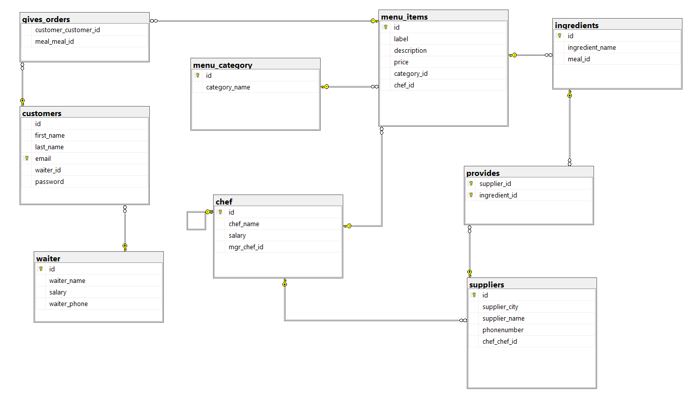

# 🍽️ Restaurant Database Project

This project is a **relational database system** designed to manage restaurant operations.  
It stores and organizes data about customers, orders, menu items, chefs, waiters, ingredients, and suppliers.

## 📌 Project Overview
The database covers all key entities of a restaurant workflow:
- Customer and order management
- Menu items and categories
- Chef and waiter details
- Ingredients and suppliers

The ERD (Entity Relationship Diagram) defines how these entities are connected.

 <!-- Replace with correct image path -->

---

## 🗄️ Database Structure

### **Tables**
| Table Name      | Description |
|-----------------|-------------|
| `customers`     | Stores customer details (name, email, waiter assigned). |
| `waiter`        | Contains information about waiters (name, salary, phone). |
| `chef`          | Contains chef details, salaries, and manager hierarchy. |
| `menu_category` | Categories for grouping menu items (e.g., appetizers, main courses). |
| `menu_items`    | Menu dishes with descriptions, prices, categories, and responsible chefs. |
| `gives_orders`  | A junction table linking customers and menu items (records orders). |
| `ingredients`   | Ingredients used for menu items. |
| `suppliers`     | Supplier details such as city, name, and contact information. |
| `provides`      | A junction table linking suppliers and ingredients. |

---

## 🔑 Key Relationships
- **One customer** can give **many orders**, but each order is linked to a menu item (`gives_orders`).
- **Menu items** belong to **categories** and are prepared by **chefs**.
- **Chefs** can manage other chefs (`mgr_chef_id` as self-reference).
- **Ingredients** are linked to menu items, and **suppliers** provide these ingredients.
- **Waiters** are assigned to customers.

---

